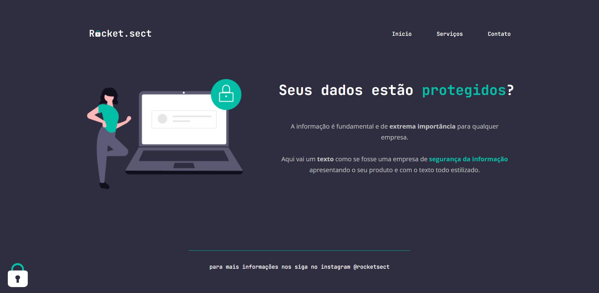

# Desafio avançado | Stage 2

> Projeto construído durante as aulas da trilha Explorer da Rocketseat.

    As aulas tiveram o objetivo de construir o HTML e o CSS da aplicação a partir de um modelo do Figma. 

🔗 [Clique aqui para acessar](https://mbslash.github.io/Desafio-avancado---Stage-2---Turma-6---Explorer---Rocketseat/)

## 💻 Tecnologias

- HTML
- CSS
- Git e Github
- Figma

## 📧 Contato

matheusb.dev@gmail.com